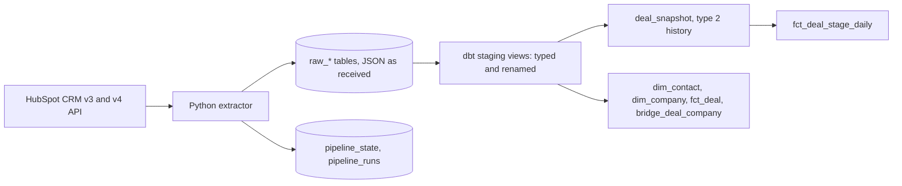

# CRM Pipeline


Incremental HubSpot to BigQuery pipeline. A Python extractor lands raw CRM
records, dbt turns them into a dimensional model, and both halves run on a
schedule with their own run history.

---

## What it does

HubSpot holds the deals; nobody wants to answer "what is in the pipeline by
stage" by exporting a spreadsheet. This moves contacts, companies and deals
into BigQuery every night, incrementally, and models them into tables a
commercial team can query without knowing what `hs_lastmodifieddate` is.



| Area | Implementation |
|---|---|
| Objects | Contacts, companies, deals, and deal associations |
| Extraction | CRM v3 search API, cursor pagination, re-anchored past the 10,000 result cap |
| Incremental | `hs_lastmodifieddate` watermark per object in `pipeline_state`, five minute overlap |
| Idempotency | Raw payload upserted with `MERGE` on the HubSpot object id |
| Resilience | Retries on 429 and 5xx, `Retry-After` honoured, exponential backoff with jitter |
| Transform | dbt: staging views, marts as tables, a type 2 snapshot for deal history |
| Tests | 28 pytest unit tests, dbt schema tests, two singular dbt tests |
| Observability | One `pipeline_runs` row per object per run, plus dbt source freshness |
| Orchestration | One entrypoint, containerised, GitHub Actions nightly |

---

## Why the raw layer exists

The extractor stores the API response as text and does nothing else to it.
Everything that reshapes a record is SQL in dbt.

That means a new HubSpot property is a model change rather than a code change
and a backfill, and a parsing mistake made in April can be corrected in May
without asking HubSpot for the data again. The cost is a JSON parse on every
staging query, which is why staging is the only layer that touches the payload.

## Why this grain

`fct_deal` is one row per deal. Every question the table exists to answer counts
deals or sums their value, and a grain of one row per deal-contact link would
multiply the amount by the number of people attached to the deal. HubSpot does
allow several companies on one deal, so the many-to-many is kept in
`bridge_deal_company` and `fct_deal` carries a `primary_company_id` chosen by an
explicit rule, with `company_count` alongside it so the simplification is
visible rather than hidden.

`fct_deal_stage_daily` is one row per day per stage, built from `deal_snapshot`
rather than from current state, because current state cannot answer what the
pipeline looked like last Tuesday.

## The trade-off I would revisit

Contacts and companies are type 1 dimensions: when a contact changes email, the
old one is gone. Deals get a type 2 snapshot because deals carry the money and
stage history is the thing people ask for. That split is a judgement about what
matters, not a general rule, and the first time someone asks which email address
a contact had when a deal closed, `dim_contact` needs to become a snapshot the
same way `deal_snapshot` already is.

---

## Running it

```bash
pip install -r requirements.txt
cp .env.example .env          # fill in the HubSpot token and GCP project
cp dbt/profiles.yml.example dbt/profiles.yml
./scripts/run_pipeline.sh     # extract, then dbt build, then source freshness
```

Or in Docker:

```bash
docker build -t crm-pipeline .
docker run --rm --env-file .env crm-pipeline
```

Extract one object type only, or fail the run when nothing was loaded:

```bash
python src/pipeline.py --objects deals --fail-on-empty
```

Offline checks, no credentials needed:

```bash
pytest tests/ -q
dbt parse --project-dir dbt --profiles-dir dbt
```

---

## Repository layout

```text
crm-pipeline/
├── src/
│   ├── config.py          # environment, validated once at startup
│   ├── hubspot_client.py  # pagination, retries, incremental search, associations
│   ├── raw_records.py     # the landing envelope, and the watermark it produces
│   ├── warehouse.py       # BigQuery schemas and the MERGE that makes loads idempotent
│   ├── state.py           # watermarks and run history
│   └── pipeline.py        # orchestration and run logging
├── dbt/
│   ├── models/staging/    # one view per raw table: unnest, rename, cast
│   ├── models/marts/      # dim_contact, dim_company, fct_deal, bridge, daily fact
│   ├── snapshots/         # deal_snapshot, type 2
│   └── tests/             # singular tests that need no packages
├── scripts/run_pipeline.sh
├── tests/                 # pytest, no network and no warehouse required
├── Dockerfile
└── .github/workflows/     # offline checks on every push, live run on a schedule
```

See [data_dictionary.md](./data_dictionary.md) for every column, and
[docs/architecture.md](docs/architecture.md) for the component boundaries.

---

## How failure is meant to look

- An object that fails to load is written to `pipeline_runs` as `failed` and the
  run stops, so dbt never builds marts on a half-loaded raw layer.
- The watermark moves only after a successful load, and only as far as the newest
  record actually landed. A failed run re-reads the same window next time.
- A run that loads nothing is recorded as `empty` rather than `success`.
  `--fail-on-empty` turns that into a non-zero exit where silence is always wrong.
- `dbt source freshness` fails after 48 hours without new data, which is the
  signal that the extractor stopped running at all.

---

## What it does not handle

- **Deletes.** A record deleted in HubSpot stays in the warehouse. Catching that
  needs either the webhooks API or a periodic full reconciliation.
- **Schema drift detection.** A renamed property surfaces as nulls in staging and
  a failing `not_null` test, not as an alert naming the property.
- **Backfill.** First run reaches back a year. Anything older needs a manual
  watermark reset, and the search API result cap makes a large backfill slow.
- **Alerting.** Failures are visible in `pipeline_runs` and in the Actions log.
  Nothing pages anyone.
- **Custom objects and activities.** Contacts, companies and deals only.
- **Deal history before deployment.** `fct_deal_stage_daily` starts the day the
  snapshot first ran. Nothing can recover the stage a deal was in last year.

---

## License

Copyright (c) 2026 Giselle Evita Koch. See [LICENSE](LICENSE) for the
proprietary source-available terms.
