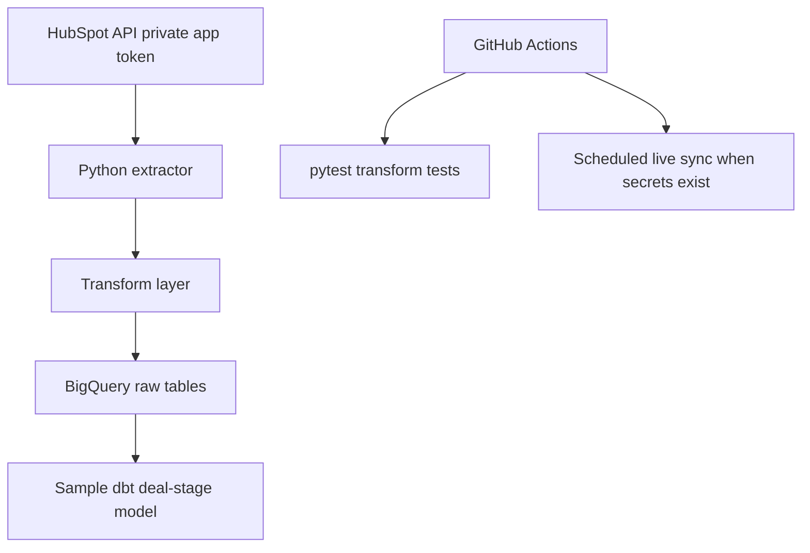

# CRM Pipeline


> Python pipeline that extracts HubSpot contacts, deals, and companies, transforms them into warehouse-friendly records, and loads full-refresh raw tables into BigQuery.

For implementation tradeoffs and next steps, see [docs/CASE_STUDY.md](docs/CASE_STUDY.md).

This repository demonstrates a compact client-style data ingestion path: API extraction, transformation tests, BigQuery loading, a sample dbt reporting model, and a scheduled GitHub Actions workflow. It is not yet an incremental production data platform.

---

## Reviewer Quick Start

For a fast technical review:

1. Run `pytest tests/ -v` to verify transformation behavior.
2. Read [data_dictionary.md](./data_dictionary.md) to understand the raw warehouse fields.
3. Inspect `src/hubspot_client.py`, `src/transform.py`, and `src/bigquery_loader.py` for the extractor/transform/load path.
4. Review `.github/workflows/pipeline.yml` to see how CI tests run offline and live syncs are skipped when secrets are unavailable.

---

## Architecture



---

## What It Does Today

| Area | Current implementation |
|---|---|
| Source objects | Contacts, deals, companies |
| Extraction | HubSpot CRM v3 objects API with pagination |
| Transform | Python dict mapping into raw warehouse fields |
| Load mode | Full refresh via BigQuery `WRITE_TRUNCATE` |
| Tests | Unit tests for transformation output shape |
| Scheduling | GitHub Actions schedule and manual dispatch |
| Secrets | Environment variables / GitHub Actions secrets |

---

## What It Does Not Yet Do

This repo does not currently include:

- incremental cursor storage
- BigQuery `MERGE` upserts
- activity sync
- production dbt project structure
- Slack alerting
- Terraform for datasets/IAM
- loader/extractor integration tests with mocks
- run metadata tables or data quality checks

Those are natural next steps, but they should not be implied as already implemented.

---

## Repository Structure

```text
crm-pipeline/
├── src/                    # Extract, transform, and load code
├── dbt_models/             # Sample dbt reporting SQL
├── tests/                  # pytest transform tests
├── .github/workflows/      # Scheduled CI + optional live pipeline run
├── data_dictionary.md      # Field definitions for synced objects
├── .env.example            # Required environment variables, no secrets
└── requirements.txt
```

---

## Data Model

See [data_dictionary.md](./data_dictionary.md) for field definitions.

Objects synced from HubSpot:

| Object | Current Sync Mode | Key Fields |
|---|---|---|
| Contacts | Full refresh | `id`, `email`, `lead_status`, `created_at`, `ingested_at` |
| Deals | Full refresh | `id`, `deal_name`, `stage`, `amount`, `pipeline`, `close_date` |
| Companies | Full refresh | `id`, `name`, `domain`, `industry`, `country`, `employees` |

---

## Quick Start

```bash
git clone https://github.com/giselleevita/crm-pipeline
cd crm-pipeline
pip install -r requirements.txt
cp .env.example .env
```

Fill in:

```env
HUBSPOT_API_KEY=your_hubspot_private_app_token
GCP_PROJECT_ID=your_gcp_project_id
GCP_DATASET_ID=crm_raw
GOOGLE_APPLICATION_CREDENTIALS=/path/to/gcp_credentials.json
```

Run tests:

```bash
pytest tests/ -v
```

Run the pipeline when credentials are configured:

```bash
python src/pipeline.py
```

---

## Credential Setup

| Secret | Where to set | Minimum scope |
|---|---|---|
| `HUBSPOT_API_KEY` | GitHub Actions secret / `.env` | HubSpot CRM object read access |
| `GCP_PROJECT_ID` | GitHub Actions secret / `.env` | Target Google Cloud project |
| `GCP_DATASET_ID` | GitHub Actions secret / `.env` | Target BigQuery dataset |
| `GOOGLE_APPLICATION_CREDENTIALS` | Runtime env var | Path to service account JSON file |

Never commit credentials. Use `.env.example` as the local template.

---

## Requirements

- Python 3.11+
- Google Cloud project with BigQuery enabled
- BigQuery dataset created before loading
- HubSpot private app token

---

## Next Improvements

- Add explicit config validation and clearer missing-secret errors.
- Add mocked HubSpot and BigQuery loader tests.
- Replace `WRITE_TRUNCATE` with staging tables and `MERGE`.
- Add incremental cursors per object type.
- Add dbt project metadata and dbt tests.
- Add Slack or email notifications for failed live runs.

---

## License

Copyright (c) 2026 Giselle Evita Koch. See [LICENSE](LICENSE) for the
proprietary source-available terms.
