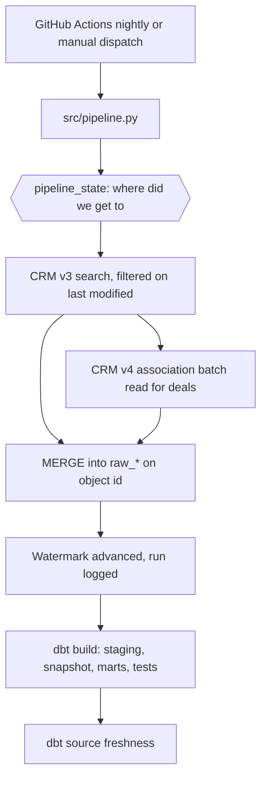

# Architecture

## Data flow

## Component boundaries

| Component | Responsibility |
|---|---|
| `src/config.py` | Resolve and validate environment once, pass it down explicitly |
| `src/hubspot_client.py` | Authenticate, retry, paginate. Returns API records untouched |
| `src/raw_records.py` | Build the landing envelope and derive the batch high-water mark |
| `src/warehouse.py` | BigQuery schemas and the MERGE statements that make loads idempotent |
| `src/state.py` | Watermarks and run history, the pipeline's control tables |
| `src/pipeline.py` | Order of operations, run logging, failure handling |
| `dbt/models/staging` | Unnest JSON, rename, cast. No business logic |
| `dbt/models/marts` | Dimensional model, grain decisions, relationship tests |
| `dbt/snapshots` | Type 2 history for deals, which HubSpot does not keep |

## Decisions worth defending

**Land raw, transform in SQL.** The extractor writes the response as text.
Reshaping happens in dbt, where it is version controlled, tested and cheap to
change. The alternative, parsing on the way in, makes every new field a code
change followed by a backfill.

**Watermark after load, never before.** `pipeline_state` moves only when the
load for that object succeeded, and only as far as the newest record that
actually landed. Writing it first would mean a failed load silently skips
records: the next run starts after them and nothing ever reports them missing.

**Overlap on every read.** Each run re-reads five minutes before its watermark,
which is what covers records modified while the previous extract was running.
Re-reading is safe because the load is an upsert keyed on the object id.

**De-duplicate inside the MERGE.** A single window can contain the same record
twice. BigQuery rejects a MERGE whose source matches a target row more than
once, so the source is ranked and filtered to one row per id before it is used.

**Associations replaced, not merged.** A deal that loses a company has no row to
update, so a plain merge would leave the stale link behind. Deals with no links
arrive in the batch with a null target, which is what allows the delete branch
to fire for exactly the deals just looked at.

**Re-anchor rather than page past the cap.** The search endpoint refuses to page
beyond 10,000 results. Sorting ascending by modification time means the query
can restart from the last record seen instead of starting over.

## Failure behaviour

| Failure | What happens |
|---|---|
| HubSpot returns 429 or 5xx | Retried with backoff, `Retry-After` honoured, then the run fails |
| Load fails for one object | `pipeline_runs` records `failed`, run stops, watermark unchanged |
| Extract succeeds, dbt fails | Raw layer is complete and correct, marts are stale from the last good build. Re-running is safe because both halves are idempotent |
| Run loads nothing | Recorded as `empty`, warning logged, non-zero exit only with `--fail-on-empty` |
| Extractor stops running entirely | `dbt source freshness` errors after 48 hours |

## If this had to scale

Partition `raw_*` on `ingested_at` and cluster on `object_id`; move association
extraction off the deal path so a large association batch cannot slow the object
load; add deletes via the webhooks API or a weekly reconciliation; replace the
`--fail-on-empty` flag with a monitor that reads `pipeline_runs` and alerts,
rather than a build that exits non-zero.
