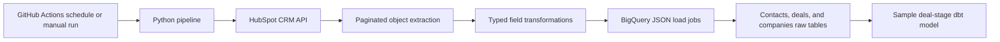

# Architecture

## Current Data Flow

## Component Boundaries

| Component | Responsibility |
|---|---|
| `src/hubspot_client.py` | Authenticate to HubSpot and paginate CRM objects |
| `src/transform.py` | Convert vendor payloads into stable warehouse records |
| `src/bigquery_loader.py` | Validate table names and load explicit BigQuery schemas |
| `src/pipeline.py` | Orchestrate contacts, deals, and companies synchronization |
| `dbt_models/` | Demonstrate a downstream reporting transformation |

## Reliability And Security Decisions

- Pull requests run offline tests and never call vendor systems.
- Scheduled live runs execute only when all required secrets are configured.
- Google service-account JSON is written to a temporary runner file with mode
  `0600` and is not stored in the repository.
- BigQuery schemas are explicit rather than inferred from API responses.
- Full refresh is deliberately used for simplicity and is documented as a
  limitation, not presented as a production-scale design.

## Production Evolution

A production implementation should add incremental cursors, staging tables and
`MERGE` operations, run metadata, data-quality checks, dead-letter handling,
alerting, and infrastructure-managed IAM.
